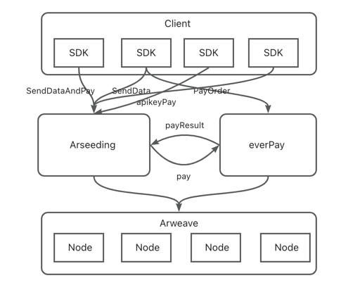

# arseedingsdk4j
Arseeding Java SDK  (Arweave Java SDK)
arseedingsdk4j is an arseeding java sdk and supports Arweavede's bundle (ANS-104) transaction type. Payments are made through everPay and the data is eventually uploaded to the Arweave blockchain network. If you have any questions during use, please contact us

# Architecture


# Features
* send data
* pay the order
* send and pay
* send data using API keys
* upload folder data
* get bundle fees
* get user orders

# getting-started
### maven-dependency
```agsl
<dependency>
    <groupId>com.github.permadao</groupId>
    <artifactId>arseedingsdk4j-sdk</artifactId>
    <version>${latest-version}</version>
</dependency>
```
### wallet init
EthereumWallet
```agsl
String fileName = "your file";
EthereumWallet ethereumWallet1 =
        EthereumWallet.loadEthereumWallet("your password", new File(fileName));
        
EthereumWallet ethereumWallet2 =
        EthereumWallet.loadEthereumWallet("your private key"); 
```
ArweaveWallet
```agsl
ArweaveWallet arweaveWallet = 
        ArweaveWallet.loanArweaveWallet("your private key");
```

### send data
```agsl
    OkHttpClient.Builder builder = new OkHttpClient.Builder();
    builder.build();
    EthereumWallet ethereumWallet =
        EthereumWallet.loadEthereumWallet(
            "your private key");
    ArSeedingService arSeedingService =
        new HttpArSeedingService(
            "https://seed-dev.everpay.io", "https://api-dev.everpay.io", builder.build());
    ArSDK arSDK = ArHttpSDK.buildArHttpSDK(arSeedingService, ethereumWallet);

    Tag tag = new Tag("abc", "abc");

    DataSendResponse usdc =
        arSDK.sendData("hello world".getBytes(), "usdc", Lists.newArrayList(tag), "", "", false);
    
    System.out.println(usdc);
```
### pay the order
```agsl
    OkHttpClient.Builder builder = new OkHttpClient.Builder();
    builder.build();
    EthereumWallet ethereumWallet =
        EthereumWallet.loadEthereumWallet(
            "your private key");
    ArSeedingService arSeedingService =
        new HttpArSeedingService(
            "https://seed-dev.everpay.io", "https://api-dev.everpay.io", builder.build());
    ArSDK arSDK = ArHttpSDK.buildArHttpSDK(arSeedingService, ethereumWallet);

    PayOrder payOrder = getPayOrder() // get the pay order
    PayOrdersResponse response = arSDK.payOrders(Lists.newArrayList(payOrder))
    
    System.out.println(response);
```
### send and pay
```agsl
    OkHttpClient.Builder builder = new OkHttpClient.Builder();
    builder.build();
    EthereumWallet ethereumWallet =
        EthereumWallet.loadEthereumWallet(
            "your private key");
    ArSeedingService arSeedingService =
        new HttpArSeedingService(
            "https://seed-dev.everpay.io", "https://api-dev.everpay.io", builder.build());
    ArSDK arSDK = ArHttpSDK.buildArHttpSDK(arSeedingService, ethereumWallet);

    Tag tag = new Tag("abc", "abc");

    DataSendOrderResponse response =
        arSDK.sendDataAndPay("hello world".getBytes(), "usdc", Lists.newArrayList(tag), "", "", false);
    
    System.out.println(response);
```
### send data using API keys
```agsl
    OkHttpClient.Builder builder = new OkHttpClient.Builder();
    builder.build();
    EthereumWallet ethereumWallet =
        EthereumWallet.loadEthereumWallet(
            "your private key");
    ArSeedingService arSeedingService =
        new HttpArSeedingService(
            "https://seed-dev.everpay.io", "https://api-dev.everpay.io", builder.build());
    ArSDK arSDK = ArHttpSDK.buildArHttpSDK(arSeedingService, ethereumWallet);

    Map<String,String> tags = new HashMap<>();
    tags.put("abc", "abc");
    String itemId = arSDK.submitNativeData("your apiKey", "usdc", "hello world".getBytes(), "", tags);
    
    System.out.println(itemId);
```

### upload folder data
```agsl
    OkHttpClient.Builder builder = new OkHttpClient.Builder();
    builder.build();
    EthereumWallet ethereumWallet =
        EthereumWallet.loadEthereumWallet(
            "your private key");
    ArSeedingService arSeedingService =
        new HttpArSeedingService(
            "https://seed-dev.everpay.io", "https://api-dev.everpay.io", builder.build());
    ArSDK arSDK = ArHttpSDK.buildArHttpSDK(arSeedingService, ethereumWallet);

    ManifestUploadResponse response = arSDK.uploadFolder("your root path", batchSize, "index file", "usdc");
    
    System.out.println(response);
```

### get bundle fees
```agsl
    OkHttpClient.Builder builder = new OkHttpClient.Builder();
    builder.build();
    EthereumWallet ethereumWallet =
        EthereumWallet.loadEthereumWallet(
            "your private key");
    ArSeedingService arSeedingService =
        new HttpArSeedingService(
            "https://seed-dev.everpay.io", "https://api-dev.everpay.io", builder.build());
    ArSDK arSDK = ArHttpSDK.buildArHttpSDK(arSeedingService, ethereumWallet);
    
    BundleFee fee = arSDK.bundleFee(size, "usdc");
    
    System.out.println(fee);
```

### get user orders
```agsl
    OkHttpClient.Builder builder = new OkHttpClient.Builder();
    builder.build();
    EthereumWallet ethereumWallet =
        EthereumWallet.loadEthereumWallet(
            "your private key");
    ArSeedingService arSeedingService =
        new HttpArSeedingService(
            "https://seed-dev.everpay.io", "https://api-dev.everpay.io", builder.build());
    ArSDK arSDK = ArHttpSDK.buildArHttpSDK(arSeedingService, ethereumWallet);
    
    List<BundleOrder> orders = arSDK.getOrders("your address", 1);
    
    System.out.println(orders);
```